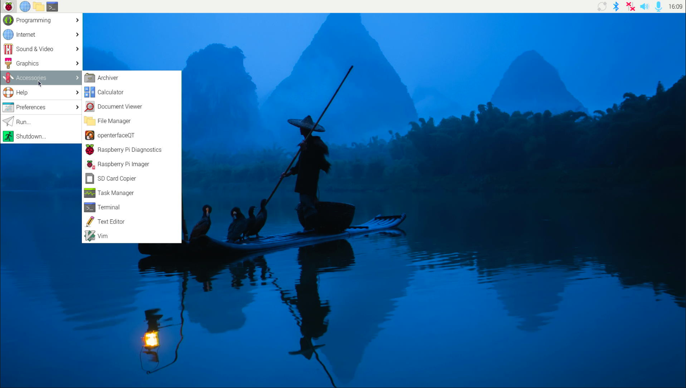

## Prerequisite: Device Permissions Setup

The OpenterfaceQT app requires access to serial and HID devices. This setup is mandatory for both Flatpak and build-from-source installations. Follow these steps to grant the necessary permissions:

1. **Add User to Groups**:

   - Open a terminal and run the following commands:

     ```bash
     sudo usermod -aG dialout $USER
     sudo usermod -aG plugdev $USER
     ```

2. **Create udev Rule for HIDRAW and ttyUSB this step is same with env**:

   - Create a new file `/etc/udev/rules.d/51-openterface.rules` with the following content:

     ```bash
     echo 'SUBSYSTEM=="hidraw", ATTRS{idVendor}=="534d", ATTRS{idProduct}=="2109", TAG+="uaccess"' | sudo tee /etc/udev/rules.d/51-openterface.rules
     echo 'SUBSYSTEM=="usb", ATTRS{idVendor}=="534d", ATTRS{idProduct}=="2109", TAG+="uaccess"' | sudo tee -a /etc/udev/rules.d/51-openterface.rules
     echo 'SUBSYSTEM=="ttyUSB", ATTRS{idVendor}=="1a86", ATTRS{idProduct}=="7523", TAG+="uaccess"' | sudo tee -a /etc/udev/rules.d/51-openterface.rules
     echo 'SUBSYSTEM=="usb", ATTRS{idVendor}=="1a86", ATTRS{idProduct}=="7523", TAG+="uaccess"' | sudo tee -a /etc/udev/rules.d/51-openterface.rules
     ```

3. **Reload udev Rules**:

   - Run the following command to reload the udev rules or reboot the machine reload the udev rules:

     ```bash
     sudo udevadm control --reload-rules
     sudo udevadm trigger
     ```

4. **Apply Changes**:

   - Log out and log back in for the changes to take effect.

## Use Flatpak Install openterfaceQT

### Download Flatpak

```sh
sudo apt install -y flatpak flatpak-builder qemu-user-static
# if you are using aarch64, maybe you need to install the following packages:
sudo apt install -y gcc-aarch64-linux-gnu g++-aarch64-linux-gnu
```

### Set up Flatpak Environment

```sh
flatpak remote-add --user --if-not-exists flathub https://dl.flathub.org/repo/flathub.flatpakrepo
# if you are using aarch64, maybe you need to install the following packages:
flatpak install --user --noninteractive flathub org.kde.Sdk/aarch64/6.9
flatpak install --user --noninteractive flathub org.kde.Platform/aarch64/6.9

# if you are using x86_64, maybe you need to install the following packages:
flatpak install --user --noninteractive flathub org.kde.Sdk/x86_64/6.9
flatpak install --user --noninteractive flathub org.kde.Platform/x86_64/6.9
```

### Download Openterface from flathub

```sh
flatpak install flathub com.openterface.openterfaceQT
```

***After you can run the app, enjoy using the OpenterfaceQT app.***

### Run the app

You can run openterfaceQT from the menu bar, as shown in the picture below.




Or you can run the openterfaceQT in the terminal, by command as follow.

```bash
   flatpak run --user com.openterface.openterfaceQT
```